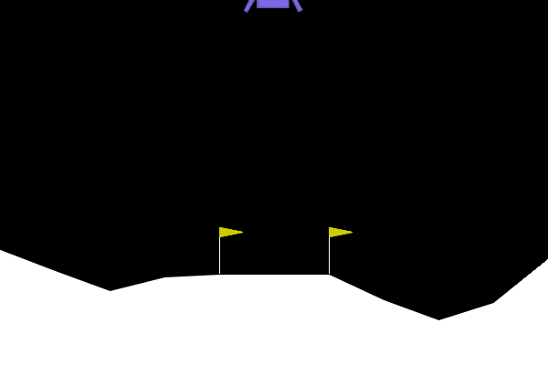
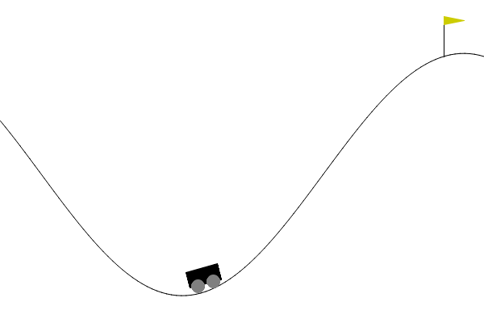
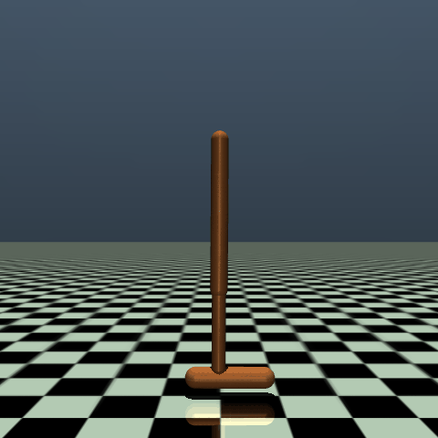
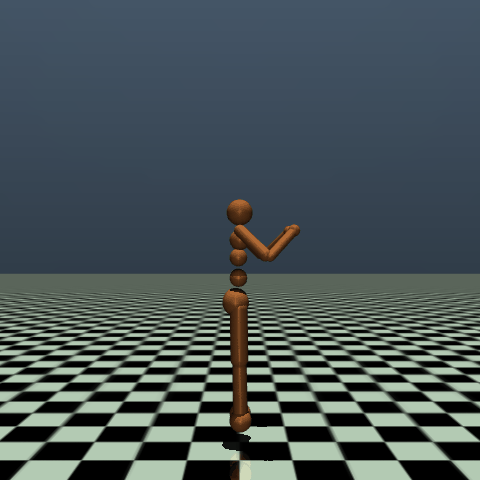

# Deep Deterministic Policy Gradients (DDPG)

This repository contains an implementation of the Deep Deterministic Policy Gradients (DDPG) algorithm as described in the paper ["Continuous control with deep reinforcement learning" by Lillicrap et al](https://arxiv.org/abs/1509.02971). The implementation is evaluated on various standard continuous control environments from the Gymnasium and MuJoCo libraries.

<table>
    <tr>
        <td>
            <p><b>Pendulum</b></p>
            
        </td>
        <td>
            <p><b>LunarLanderContinuous</b></p>
            
        </td>
        <td>
            <p><b>MountainCarContinuous</b></p>
            
        </td>
        <td>
            <p><b>BipedalWalker</b></p>
            
        </td>
    </tr>
    <tr>
        <td>
            <p><b>Hopper</b></p>
            
        </td>
        <td>
            <p><b>Humanoid</b></p>
            
        </td>
        <td>
            <p><b>Ant</b></p>
            
        </td>
        <td>
            <p><b>HalfCheetah</b></p>
            
        </td>
    </tr>
</table>

## Overview

DDPG is an actor-critic algorithm designed for environments with continuous action spaces. This implementation includes components such as an actor network, a critic network, replay memory, and action noise.

The paper introduces Deep Deterministic Policy Gradient (DDPG), an actor-critic, model-free algorithm tailored to continuous action domains. Building on the deterministic policy gradient (DPG) framework, DDPG adapts techniques from Deep Q-Network (DQN) to handle high-dimensional, continuous action spaces. The algorithm has been tested successfully on over 20 simulated physics tasks, demonstrating its effectiveness across a variety of complex environments, including challenges like dexterous manipulation and autonomous driving.

### Key Highlights

- **Extension to Continuous Actions:** DDPG extends the ideas from DQN to continuous action spaces, addressing the limitations of DQN which is confined to discrete actions.
- **Actor-Critic Architecture:** The implementation uses an actor-critic framework, where the actor directly maps states to actions and the critic evaluates the action by computing the value function.
- **Stability Enhancements:** Incorporating techniques such as experience replay and target networks from DQN helps stabilize the training with function approximators in continuous action domains.
- **Utilization of Batch Normalization:** DDPG incorporates batch normalization to manage the diverse scale of inputs effectively, especially when dealing with different physical units and varied ranges across environments. This normalization standardizes each input dimension to have zero mean and unit variance within each mini-batch, facilitating faster and more stable training. This technique not only helps in adapting the network to changes in input scales without manual tuning but also enhances the generalization of the model across different tasks.
- **End-to-End Learning from Pixels:** DDPG demonstrates the ability to learn policies directly from raw pixel inputs across various tasks, proving the algorithm's robustness and versatility.

## Setup

### Requirements

Install the required dependencies using the following command:

```bash
pip install -r requirements.txt
```

### Running the Algorithm

You can run the algorithm on any supported Gymnasium environment. For example:

```bash
python main.py --env 'LunarLanderContinuous-v2'
```

## Acknowledgements

Special thanks to Phil Tabor, an excellent teacher!
