# Deep Deterministic Policy Gradients (DDPG)

## Overview 

This repository contains an implementation of the Deep Deterministic Policy Gradients (DDPG) algorithm, as described in the paper ["Continuous control with deep reinforcement learning" by Lillicrap et al](https://arxiv.org/abs/1509.02971), and evaluated on various standard continuous control environments from the Gymnasium and MuJoCo libraries. DDPG is an actor-critic, model-free algorithm tailored to continuous action domains. Building on the deterministic policy gradient (DPG) framework, DDPG adapts techniques from Deep Q-Network (DQN) like experience replay and the use of target networks to stablize training and handle high-dimensional, continuous action spaces. The authors also incorporate batch normalization in the actor network to manage the diverse scale of different inputs effectively, however this implementation makes use of PyTorch's [LayerNorm](https://pytorch.org/docs/stable/generated/torch.nn.LayerNorm.html) as it is invariant to batch size and allows for a cleaner implementation of the target network parameter updates. 

## Setup

### Required Dependencies

Install the required dependencies using the following command:

```bash
pip install -r requirements.txt
```

### Running the Algorithm

You can run the algorithm on any supported Gymnasium environment. For example:

```bash
python main.py --env 'LunarLanderContinuous-v2'
```

--- 

<table>
    <tr>
        <td>
            <p><b>Pendulum-v1</b></p>
            
        </td>
        <td>
            <p><b>LunarLanderContinuous-v2</b></p>
            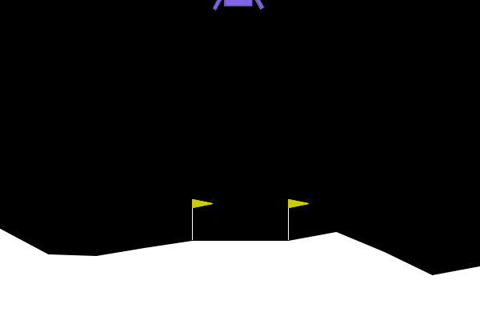
        </td>
        <td>
            <p><b>MountainCarContinuous-v0</b></p>
            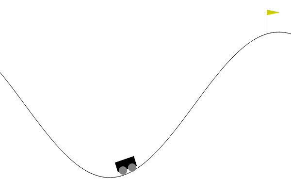
        </td>
    </tr>
    <tr>
        <td>
            
        </td>
        <td>
            
        </td>
        <td>
            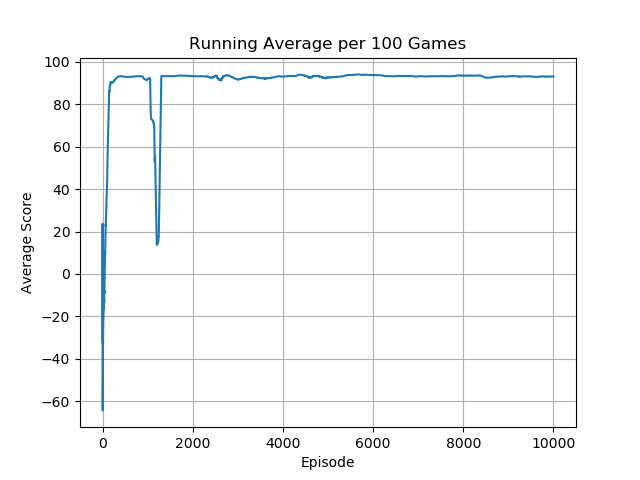
        </td>
    </tr>
</table>
<table>
    <tr>
        <td>
            <p><b>BipedalWalker-v3</b></p>
            
        </td>
        <td>
            <p><b>Hopper-v4</b></p>
            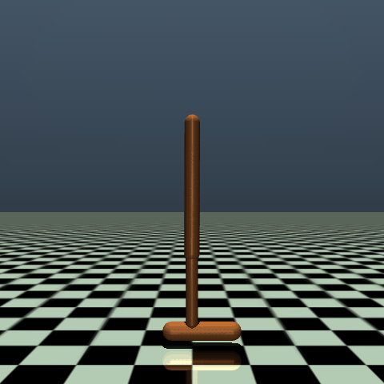
        </td>
        <td>
            <p><b>Humanoid-v4</b></p>
            
        </td>
    </tr>
    <tr>
        <td>
            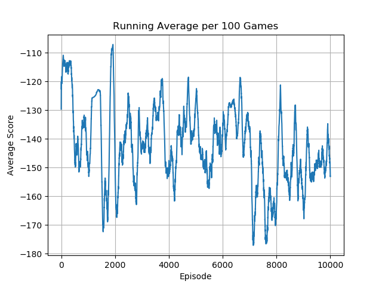
        </td>
        <td>
            
        </td>
        <td>
            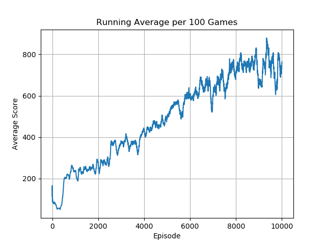
        </td>
    </tr>
</table>
<table>
    <tr>
        <td>
            <p><b>Ant-v4</b></p>
            
        </td>
        <td>
            <p><b>HalfCheetah-v4</b></p>
            
        </td>
        <td>
            <p><b>HumanoidStandup-v4</b></p>
            
        </td>
    </tr>
    <tr>
        <td>
            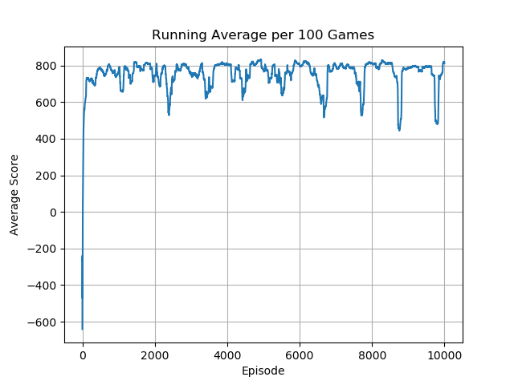
        </td>
        <td>
            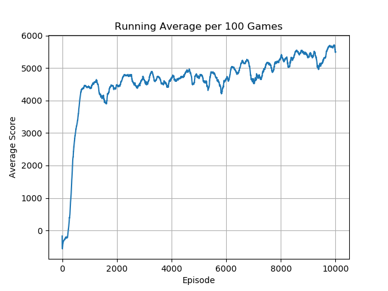
        </td>
        <td>
            
        </td>
    </tr>
</table>
<table>
    <tr>
        <td>
            <p><b>InvertedDoublePendulum-v4</b></p>
            
        </td>
        <td>
            <p><b>InvertedPendulum-v4</b></p>
            
        </td>
        <td>
            <p><b>Pusher-v4</b></p>
            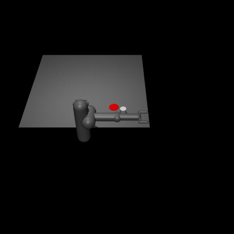
        </td>
    </tr>
    <tr>
        <td>
            
        </td>
        <td>
            
        </td>
        <td>
            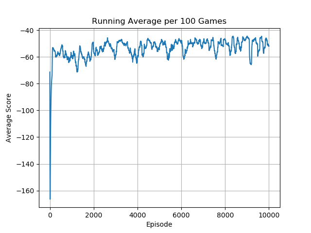
        </td>
    </tr>
</table>
<table>
    <tr>
        <td>
            <p><b>Reacher-v4</b></p>
            
        </td>
        <td>
            <p><b>Swimmer-v3</b></p>
            
        </td>
        <td>
            <p><b>Walker2d-v4</b></p>
            
        </td>
    </tr>
    <tr>
        <td>
            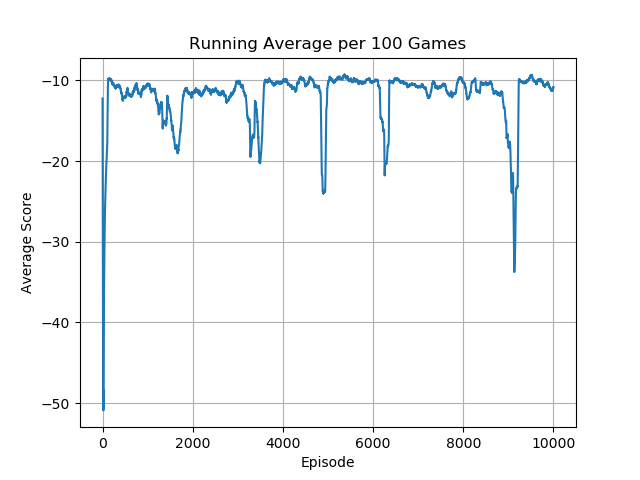
        </td>
        <td>
            
        </td>
        <td>
            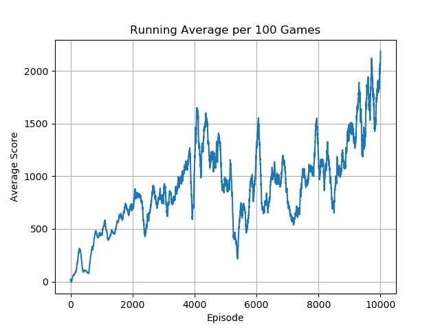
        </td>
    </tr>
</table>

No hyper-parameter tuning was conducted for these benchmarks. This was an intentional choice to compare the generalized algorithm performance across a variety of environments. As such, there are several cases where the agent fails to the effectively learn, and others where the agent was still learning after 1000 epochs. I personally find it rather interesting that the algorithm does well on tasks like the mountain car and lunar lander, while it appears to struggle with the inverted pendulum. DDPG is notable for being brittle to starting conditions and hyper-parameter choices which can affect its perfoormance, a limitation addressed by subsequent improvments in algorithms like Soft Actor-Critic (SAC) and Proximal Policy Optimization (PPO). 


## Acknowledgements

Special thanks to Phil Tabor, an excellent teacher! I highly recommend his [Youtube channel](https://www.youtube.com/machinelearningwithphil).